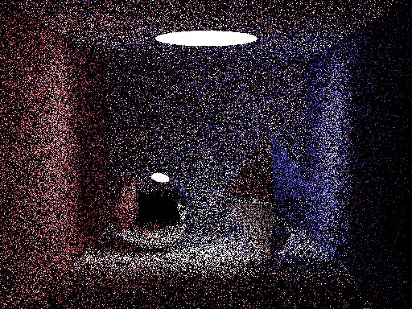

# Snailtracer benchmark

**big.Int**

**uint256**

**Render (SPP=5)**

Check out [Karalabe's repo](https://github.com/karalabe/snailtracer) for [a higher SPP render](https://raw.githubusercontent.com/karalabe/snailtracer/master/snailtracer.png).

