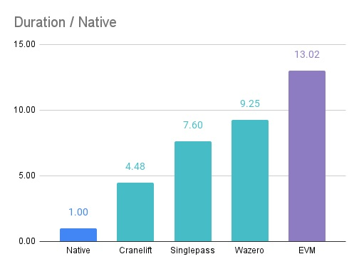
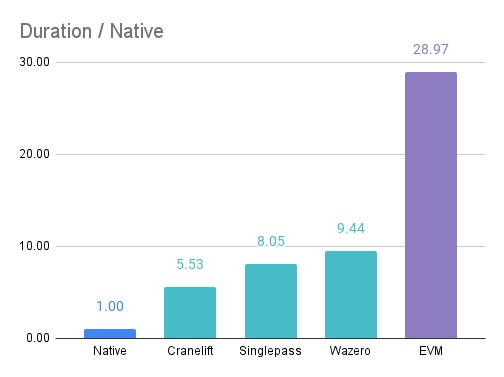
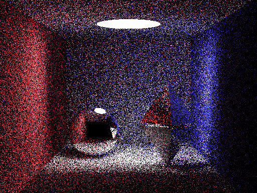

# Snailtracer benchmark

**big.Int**

**uint256**

**Render (512x384 SPP=16)**

Check out [Karalabe's repo](https://github.com/karalabe/snailtracer) for [a higher resolution render](https://raw.githubusercontent.com/karalabe/snailtracer/master/snailtracer.png).

